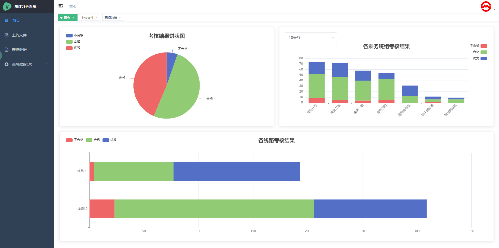
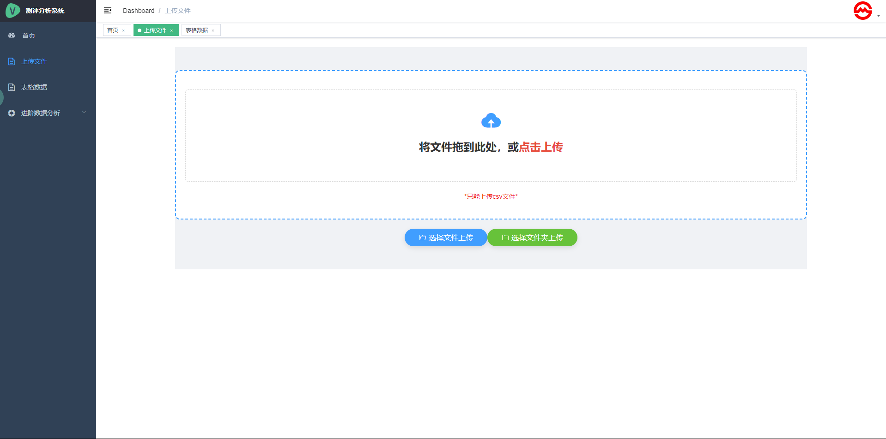
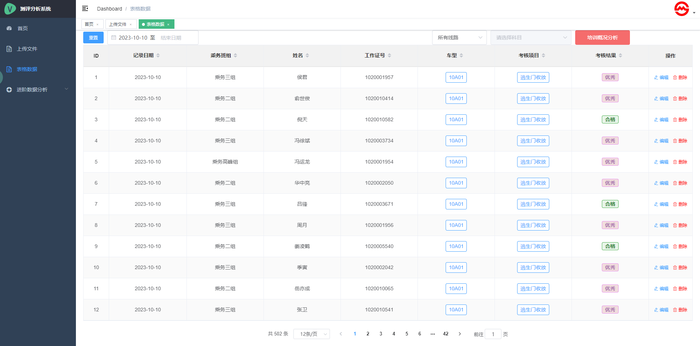

# vue-admin-template

> 这是一个极简的 vue admin 管理后台。它只包含了 Element UI & axios & iconfont & permission control & lint

## 环境安装

### 1. 切换路径安装所需要的依赖

> 移动到前端文件所在的路径

```bash
cd vue-admin-template-master
```

> 安装依赖

```bash
npm install
```

### 2. 启动前端的服务器
```bash
npm run server
```

### 浏览器访问 [http://localhost:8080](http://localhost:8080)




## 发布

```bash
# 构建测试环境
npm run build:stage

# 构建生产环境
npm run build:prod
```